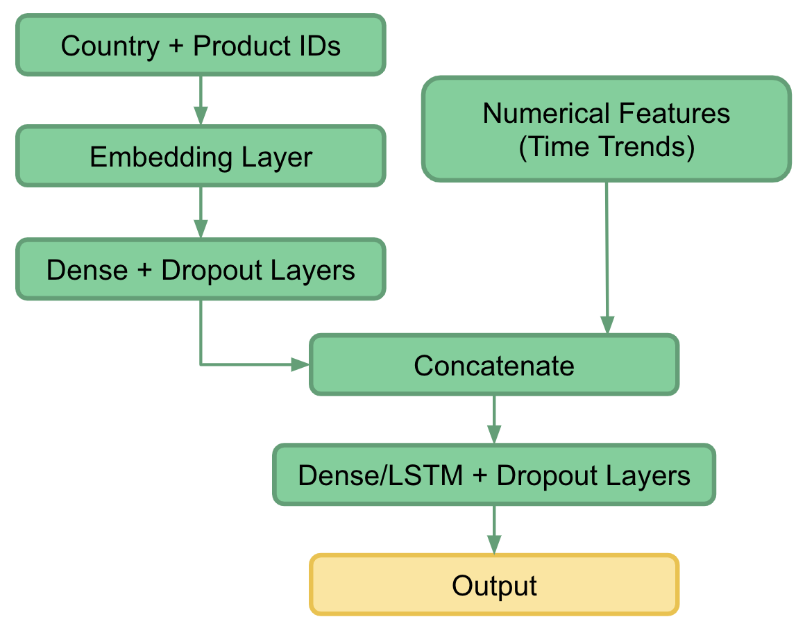

# Insight Time Series Recommender - Economics Theory Overview

## Economic Insights
I built a recommender system which makes recommends which export areas will grow the most in a given country - this can be a useful tool for helping both investors and central governments to determine where to invest their money and resources. These recommendations are based on identifying export areas which similar countries export, but the country in question doesn't. Accordingly, our recommender system suggests what countries _should_ export based on their economic profiles - i.e. what areas would be easiest for them to move into. The application of recommender systems in this way is a novel approach for both economics and deep learning in general.

It might indeed seem odd to make predictions for country-level exports in this way. Here, it's important to highlight 1) some facts from economics which motivate this unusual approach and 2) two different modalities of prediction which this project is exploiting.

**First, to understand the basic economics.** The inspiration behind using recommender systems to make country-level predictions is driven by the theory of economic complexity. "Complexity" is a measure of embedded economic know-how or capabilities, as measured according to the products which a country makes, the diversity of those products, and the ubiquity of those products, or the number of other countries which are able to produce them. Economic complexity suggests two stylized facts that underpin this analysis:

  1) Countries are able to competitively produce exports which lie within or close to their current productive capabilities.
  2) Countries with similar capabilities overall will export similar products - and, hence, will have a similar distance to enter new product areas.

As such, countries with similar export profiles (similar products/capabilities/complexities/distance to new products) can likely learn from each other's development pathways. These facts suggest that a recommender system may be a useful tool to derive recommendations about what products a country _should_ move into. (See http://atlas.cid.harvard.edu/learn for more information about complexity theory.)

The resulting recommendations can be validated against what actually happens in reality. Thus, we validate what we think _should_ happen against what _will_ or does _actually_ happen (training on 1995-2004, Period 1, and validating on 2005-2014, Period 2). This is a difficult problem to do validation for, noting that what countries "should" do is not necessarily what they "actually" do. What do I mean by what they "should" do vs. what they "actually" do?

**Second, to answer this question, let's understand two different modalities of prediction.** Recommendations from a recommender system are indeed predictions in a general sense, but they're a different type of prediction than we normally think of in economics. In the context of a normal time series forecasting approach, we base predictions off of country A's own trade patterns: e.g. if country A always exported 0 of some product in the past, the correct prediction going forward would be 0. But in the context of a recommender system (this project), we base predictions off of other countries' trade patterns: e.g. even if country A has always exported 0 of some product, if all other comparable countries are trading the product, the prediction would be pushed upward from 0 for country A. This is especially useful in order to identify economic laggards and improve export complexity.

**OK. What does this mean practically?**

While recommendations may not always align with actual export trends, I find strong results suggesting alignment between predicted recommendations and actual export trends.

Exploiting this information, at best, my recommender system approach can beat economic forecasts in anticipating the emergence of new product areas in new markets. At minimum, our recommender system can provide invaluable hypothesis generation for investors and governments looking to expand into new products or markets.

In general terms, the model finds countries which have similar economic profiles to each other and makes recommendations for export areas based on which areas each country is inactive or sub-optimally active in (relative to the comparison countries). For example, if the total economy consists of 10 goods Country A and Country B are found to be similar based on their export of goods 1-9, but Country A trades in the 10th good while Country B doesn't, we can recommend that Country B should also move into the 10th good. This idea leverages the user-item collaborative filtering, as used by companies like Amazon or Netflix, which are recommending different products or movies to different users. Here, countries are the "users" and export product/service areas are the "items."

The project leverages data from the ATLAS of Economic Complexity, including 250 countries, 5,000+ product and service areas, and 20 years, comprising 25 million+ records in total. The model is trained on data from 1995-2004 and tested on data from 2005-2014 - so, the way of thinking about this problem is **"how can we use information about the structure of the economy from one slice in time in order to recommend what the structure of the economy should look like in the following slice of time?"** A 10-year period is used for training because shifts in trade patterns occur gradually and the data includes high variance on a strictly year-to-year basis (partially due to reporting errors).

While the actual magnitude of growth can be better predicted by individual growth models (e.g. time series regression or RNNs) for specific product/service areas, it is novel to use recommender systems to generate _hypotheses_ about potential growth areas in economics or finance.

## Contributions to Deep Learning and Economics

This project makes 4 unique contributions to deep learning and economics:

1) Incorporates time-series information into deep learning recommender systems.

2) Develops a framework for combining multiple embeddings and continuous feature classes to further specify the model.

3) Develops a methodology for effectively standardizing economic data with high variance and a large class imbalance in order to be trained on neural networks. Specifically, I found that the best results were achieved when standardizing across all countries and years for the total export value. This is despite the fact that intuition might tell us that we should normalize across groups of countries or years which are more similar.

4) Introduces a new application area for deep learning and recommender systems more generally - specifically, economic trade and financial networks.

## Further Thoughts from Economics

When considering the model's recommendations, we should also keep in mind:

1) Countries with more diversified export profiles exhibit greater and more stable economic growth. This further motivates the need for investors/countries to be able to predict which new areas they could diversify into.

2) Country-level export profiles change dramatically over time, opening up opportunities both for economic growth, though sometimes at slow increments. The reasons that a country does or does not move into a given product/service area may differ, which make it difficult to validate what "should" happen relative to what actually "does" happen. Specifically, there are two scenarios to keep in mind:

      A) Country A moves into a certain product/service area because it think it's a good move (e.g. subsidizing an industry), even though it really isn't. In this case, exports go up, perhaps for a short time, but the change doesn't persist and a model at time 0 (before the country moves into this export area and provided that other countries haven't made a similar blunder) would have no way of predicting this type of "should."

      B) Country A "should" objectively move into a certain export area, according to this user-item recommender system model and economic complexity theory in general, but it isn't unable to do so due to various industrial, labor market, or political constraints, for example. In this case, exports don't go up and, while the model predicts that the country "should" move into this export area, validation on real data fails because - in reality - Country A doesn't move into the new export area.

3) The model validates what _should_ happen against what does _actually_ happen using cosine similarity (measured on rank of export growth percent). Because of the facts outlined above, it may actually be the case that what countries _should_ do is quite dissimilar from what countries _actually_ do. In this case, recommendations which are more differentiated from reality may actually be ideal - and we perhaps instead should look for a lower or more orthogonal cosine similarity score. It's hard to validate this problem outright - which is why it's important to combine these recommendations with individual quantitative and qualitative due diligence for each recommended product area, including modeling various forecasting scenarios.

4) The idea that countries with similar economic complexity can learn from each other does not necessarily mean that countries with similar economic profiles follow similar development paths. It is unclear if this is actually borne out historically. However, shared development trajectories could certainly be an implication of economic complexity theory.

Given these motivations (and problems), a deep-learning-based recommender system can provide an important avenue for helping solve some outstanding problems in economics and provide direct benefit to both investors and central governments.

## High-Level Findings

1) Trade areas with large growth globally may dominate the top 10 recommendations for many countries (e.g. ICT, tourism, financial services, oil, etc.) Beyond the top 10, we begin to see more personalization specific to each country.

2) Because the model is searching for similarly structured economies, and any change relative to 0 will be the easiest to detect, the model should be particularly good at making recommendations in areas where a country is lagging relative to its counterparts.

3) The model may do less well at predicting changes between already well-established export areas.

## Further Enhancements

The model is a proof of concept and can be further improved through some of the following approaches:

1) Using a graph alignment score to further tune the model, or entirely re-hashing the problem using graph neural networks. This would require building a separate attributed graph database for every country-year iteration. While cumbersome, this could provide outstandingly better results.

2) Re-framing as a classification problem - e.g. is the product/service area a new good or not?

3) Re-training the model using oversampling of the minority class. i.e. Most products/services are 0 for most countries - this skews the overall predictions downward; so we should oversample any products/services which are actually traded).

4) Individual prediction of specific product/service areas on a time-series or LSTM model

## Network Architecture

The architecture for this neural network was inspired from NLP networks which combine embeddings with continuous features, as seen here: http://digital-thinking.de/wp-content/uploads/2018/07/combine.png

