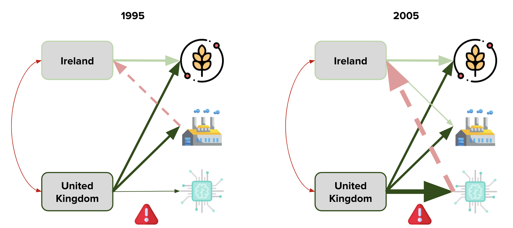

# Insight Time Series Recommender

Deep learning to recommend export growth areas across countries, and products, and time.

## Project Overview

How do investors and central governments determine where to invest in an economy? While time series forecasting is one potential way of predicting growth in a given sector over time, there are not good methods for comparing multiple sectors across multiple countries over time. More, while these forecasts are a reasonable measure of the state of the world "as it is" changing, they are not necessarily economically sound recommendations of how a country "should" change - i.e. based on what is easiest for them, their relative strengths, and similarities to other economies.

In order to solve this problem, I take a recommendations-oriented approach to forecasting rather than a purely predictions-oriented approach.

This project combines collaborative filtering recommender systems and time series analysis in order to provide recommendations for export growth across 250 countries and territories, over 5,000 product areas, and 20 years. The model is trained on data from 1995-2004 and makes recommendations on data from 2005-2014.

The source code includes a command line interface - the user can input a country/territory and the model will recommend the top 50 product/service areas which that country/territory should export, based on measured country-product similarities.

Slides describing this project and be found here: http://bit.ly/time-rec-demo

## Motivation for this project format:

- **Insight_Project_Framework** : Put all source code for production within structured directory
- **tests** : Put all source code for testing in an easy to find location
- **configs** : Enable modification of all preset variables within single directory (consisting of one or many config files for separate tasks)
- **data** : Include example a small amount of data in the Github repository so tests can be run to validate installation
- **build** : Include scripts that automate building of a standalone environment
- **static** : Any images or content to include in the README or web framework if part of the pipeline

## Requisites

- Linux or MacOS. Windows may work as well, but I have not tested it.
- `git`
- `conda`
  * Install [here](https://docs.conda.io/projects/conda/en/latest/user-guide/install/)
- `pip`
  * For example, on Ubuntu 18.04 run `sudo apt-get install python3-pip`
- `python` (Python version 3.6.8)

## Setup

1. Clone repository.
```
git clone https://github.com/faransikandar/Insight_Time_Series_Recommender.git
```

2. Set up a conda environment and activate it. (Here, the environemnt is called 'time-series-rec', but you can call it whatever you like.)
```
cd Insight_Time_Series_Recommender
conda create --name time-series-rec python=3.6
conda activate time-series-rec
```

3. Install pip within your conda environment and install the project dependencies from `requirements.txt`
```
conda install pip
pip install -r build.requirements.txt
```

## Run an Example Script - Clean Data, Train, and Make Recommendations

Note: For ease, scripts are preceded by a `source` prefix, denoting the directory they're housed in.

Clean Data, Train, and Make Recommendations in one pipeline - using 2-digit product/service area specificity (the full model is trained on 6-digit specificity). This will take ~5 min.

**Note that you will be prompted for a user input for the country/territory name.**

Spelling/capitalization matters. Also please note that some of the broader regions (e.g. Asia) do not have recommendation data available, although they appear in the options list.
```
python -m source.time_series_rec_example
```

## Results

### Collaborative Filtering Over Time - An Example

Collaborative filtering works well for static time slices. But how might recommendations change over time? We want to be able to account for changes in trends over time (note the arrows signifying an increase in England's trade in technology from 1995 to 2005).



### Positive Results - Making Recommendations that  Accurately Predict Growth

We get good results. For example, we are able to make recommendations for Ireland that Information Communication Technologies (ICT), Transport, and Financial Services would be its highest growth export sectors. Indeed, *even though its economy was predominantly machinery and chemicals-focused in 1995*, it shifted largely to services including ICT, Transport, and Financial by 2014.

**To be clear, these product/service areas were not part of the training data, nor were they the highest growth areas in Ireland during the training period - yet we still predicted (i.e. recommended) them to be the highest growth areas!**


#
repo_name=Insight_Project_Framework # URL of your new repository
username=mrubash1 # Username for your personal github account
git clone https://github.com/$username/$repo_name
cd $repo_name
echo "export $repo_name=${PWD}" >> ~/.bash_profile
echo "export PYTHONPATH=$repo_name/src:${PYTHONPATH}" >> ~/.bash_profile
source ~/.bash_profile
```
Create new development branch and switch onto it
```
branch_name=dev-readme_requisites-20180905 # Name of development branch, of the form 'dev-feature_name-date_of_creation'}}
git checkout -b $branch_name
```

## Initial Commit
Lets start with a blank slate: remove `.git` and re initialize the repo
```
cd $repo_name
rm -rf .git   
git init   
git status
```  
You'll see a list of file, these are files that git doesn't recognize. At this point, feel free to change the directory names to match your project. i.e. change the parent directory Insight_Project_Framework and the project directory Insight_Project_Framework:
Now commit these:
```
git add .
git commit -m "Initial commit"
git push origin $branch_name
```

## Requisites

- List all packages and software needed to build the environment
- This could include cloud command line tools (i.e. gsutil), package managers (i.e. conda), etc.

#### Dependencies

- [Streamlit](streamlit.io)

#### Installation
To install the package above, pleae run:
```shell
pip install -r requiremnts
```

## Build Environment
- Include instructions of how to launch scripts in the build subfolder
- Build scripts can include shell scripts or python setup.py files
- The purpose of these scripts is to build a standalone environment, for running the code in this repository
- The environment can be for local use, or for use in a cloud environment
- If using for a cloud environment, commands could include CLI tools from a cloud provider (i.e. gsutil from Google Cloud Platform)
```
# Example

# Step 1
# Step 2
```

## Configs
- We recommond using either .yaml or .txt for your config files, not .json
- **DO NOT STORE CREDENTIALS IN THE CONFIG DIRECTORY!!**
- If credentials are needed, use environment variables or HashiCorp's [Vault](https://www.vaultproject.io/)


## Test
- Include instructions for how to run all tests after the software is installed
```
# Example

# Step 1
# Step 2
```

## Run Inference
- Include instructions on how to run inference
- i.e. image classification on a single image for a CNN deep learning project
```
# Example

# Step 1
# Step 2
```

## Build Model
- Include instructions of how to build the model
- This can be done either locally or on the cloud
```
# Example

# Step 1
# Step 2
```

## Serve Model
- Include instructions of how to set up a REST or RPC endpoint
- This is for running remote inference via a custom model
```
# Example

# Step 1
# Step 2
```

## Analysis
- Include some form of EDA (exploratory data analysis)
- And/or include benchmarking of the model and results
```
# Example

# Step 1
# Step 2
```

## Project Structure
```
├── LICENSE
├── README.md             <- The top-level README for developers using this project
│
├── build
│   └── requirements.txt  <- The requirements file for reproducing the analysis environment
│
├── data
│   ├── example           <- data_example.h5 dataset for running fast examples locally
│   └── preprocessed      <- data_prep_{}.h5 files including intermediate calculations
│   └── processed         <- data_clean_{}.h5 files used in final inference
│   └── raw               <- full, raw data used for training full model
│
├── images                <- Images used in README.md, including sample output
│
├── models                <- Various pre-trained models
│
├── source                        <- Source code, various python executable files
│   ├── data_cleaner.py           <- Cleans raw data
│   └── data_example_creation.py  <- Create example data for fast runs of model testing
│   └── data_loader.py            <- Function for loading data in different modules
│   └── model_builder.py          <- Build (train or load) DL models
│   └── rec_predicter.py          <- Make predictions/recommendations
│
├── requirements.txt      <- The requirements file for reproducing the analysis environment
│
└── README-ECON.md        <- Detailed README outlining the economic theory behind the model
```
